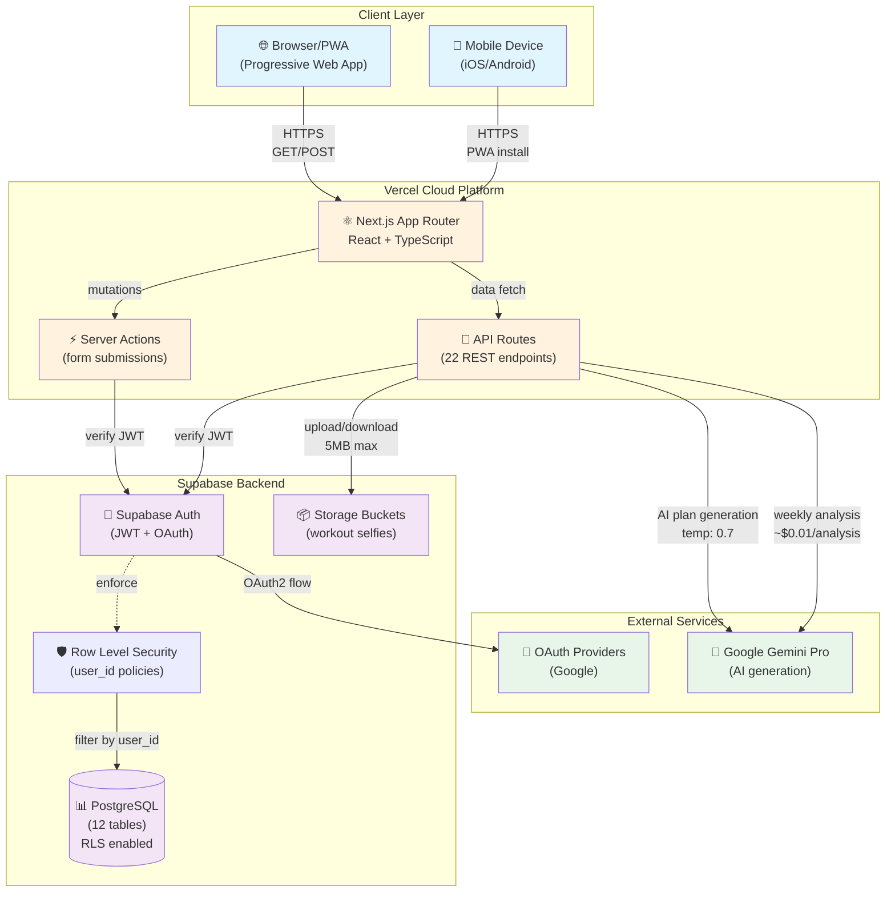
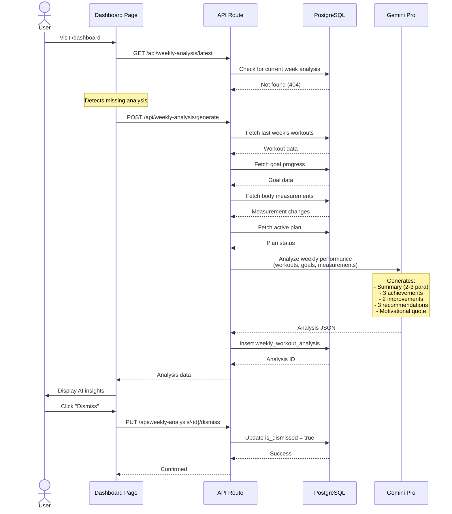
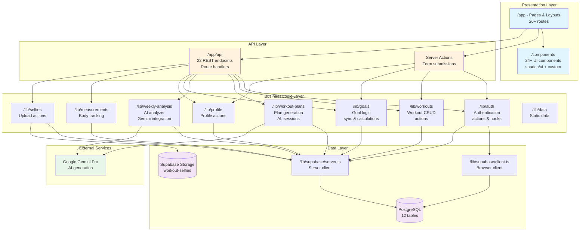

# Architecture Overview

## System Design

### High-Level Architecture

The application follows a modern **JAMstack architecture**, a design philosophy centered around delivering web applications with superior performance, security, and scalability. The name stands for:
- **J**avaScript: All dynamic functionality and user interaction is handled by JavaScript running in the browser (React, Next.js).
- **A**PIs: Server-side logic is encapsulated in reusable APIs, accessed over HTTPS (Next.js API Routes, Supabase, Google Gemini).
- **M**arkup: The user interface is pre-built into static HTML files at build time and served globally from a CDN.

This approach decouples the frontend from the backend. Instead of a traditional server building pages on every request, the application is pre-built and served instantly from Vercel's global CDN. Dynamic content is then loaded as needed via API calls, resulting in a faster and more resilient user experience.

The core components of this architecture are Next.js on Vercel, Supabase for backend services, and Google Gemini for AI capabilities.



**Flow Explanation:**

The user journey begins in the browser or the installed Progressive Web App (PWA), where they interact with the Next.js frontend hosted on Vercel. For data-fetching, the client makes HTTPS requests to Next.js API Routes. For data mutations, such as submitting a form to log a workout, the application uses Server Actions for a seamless user experience with optimistic UI updates.

Both API Routes and Server Actions act as a gateway to the Supabase backend. Every request to Supabase is authenticated using JWTs managed by Supabase Auth. Supabase's powerful Row-Level Security (RLS) policies ensure that any query to the PostgreSQL database is automatically scoped to the authenticated user's data, providing a critical layer of security and data privacy.

For features requiring AI, such as generating a new workout plan or analyzing weekly progress, the API routes communicate with Google's Gemini Pro model. User-uploaded images, like workout selfies, are securely handled by Supabase Storage.

## Tech Stack

This section outlines the key technologies and the rationale for their selection.

### Frontend
- **Framework: Next.js (App Router)**: Chosen for its hybrid rendering capabilities (SSR/SSG), file-based routing, and seamless deployment on Vercel. The App Router enables a modern, component-centric architecture.
- **Language: TypeScript**: Enforces static typing to catch errors early, improve code quality, and make the codebase more maintainable and self-documenting.
- **UI: React + Tailwind CSS + shadcn/ui**: This combination allows for building a modern, responsive, and accessible user interface. React provides the component model, Tailwind CSS offers a utility-first styling approach, and shadcn/ui delivers unstyled, composable components built on Radix UI for maximum flexibility.
- **State Management: Zustand**: A minimal, fast, and scalable state management solution. Its simple, hook-based API reduces boilerplate and is ideal for managing shared client-side state without the complexity of larger libraries.
- **Forms: React Hook Form + Zod**: Provides a powerful and efficient solution for form state management and validation. React Hook Form minimizes re-renders, while Zod enables schema-based validation on both the client and server.
- **Charts: Recharts**: A composable charting library for React, used to create the data visualizations for workout progress and body measurements.
- **Icons: Lucide React**: A library of clean, consistent, and lightweight SVG icons that are easy to customize and tree-shake.
- **Date Utils: date-fns**: A modern and lightweight library for date manipulation, offering a simple API and immutable functions.
- **Notifications: Sonner**: Provides an elegant and unobtrusive way to display toast notifications for user actions like saving data or encountering an error.
- **PWA: @ducanh2912/next-pwa**: Enables Progressive Web App capabilities, allowing users to install the application on their devices for offline access and a native-like experience.

### Backend
- **Platform: Supabase (PostgreSQL)**: A Backend-as-a-Service (BaaS) platform that provides a managed PostgreSQL database, authentication, storage, and auto-generated APIs. It was chosen to accelerate development by handling backend infrastructure, allowing the team to focus on application features.
- **Database: PostgreSQL**: A powerful, open-source object-relational database known for its reliability, data integrity, and rich feature set, including native support for JSONB and Row-Level Security.
- **Authentication: Supabase Auth**: A complete authentication solution that handles user registration, login (email/password and OAuth), and JWT management. It integrates seamlessly with PostgreSQL's Row-Level Security.
- **File Storage: Supabase Storage**: Used for securely storing user-uploaded files like workout selfies. Access is controlled by RLS policies, ensuring users can only access their own files.
- **Security: Row-Level Security (RLS)**: A core security feature of PostgreSQL, leveraged via Supabase. It enforces data access policies at the database level, guaranteeing that all queries are automatically filtered by the authenticated user's ID.
- **API Layer: Next.js API Routes & Server Actions**: Backend logic is co-located with the frontend in the Next.js application. API Routes provide traditional REST endpoints, while Server Actions handle form submissions and mutations directly from components, simplifying data flow.

### AI Services
- **Provider: Google Gemini Pro**: A powerful large language model from Google, chosen for its advanced reasoning capabilities, large context window, and cost-effectiveness. It is used to power the AI-driven features of the application, including personalized workout plan generation and weekly performance analysis.

## Key Architectural Decisions

See [ADRs](adr/) for detailed decision rationale:
- [001: Weekly Analysis with Gemini AI](adr/001-weekly-analysis-ai-gemini.md)

## Database Schema

### Entity Relationship Diagram

12 tables with full Row-Level Security (RLS) policies. All tables implement soft deletes via `deleted_at` timestamp.


### Design Patterns
- **Soft Delete:** All tables use `deleted_at` timestamp
- **RLS:** All queries filtered by `auth.uid()` with specific policies per table
- **Denormalization:** Stats stored in JSONB for performance (exercises in sessions, weekly_stats, goal_progress)
- **Indexing:** Composite indexes on `(user_id, date, deleted_at)` for optimal query performance
- **Unique Constraints:** `unique_user_week` on weekly_workout_analysis prevents duplicate analysis

### Table Highlights
- **workout_selfies**: Stores images in Supabase Storage bucket 'workout-selfies' (max 5MB per file)
- **workout_templates**: 10 public templates seeded (StrongLifts 5x5, PPL, HIIT, Core, etc.)
- **workout_plan_sessions**: Day-of-week based scheduling (0=Sunday, 6=Saturday) with actual_date
- **body_measurements**: 20+ metrics tracked (weight, body fat, muscle mass, circumferences, visceral fat, metabolic age)
- **user_workout_preferences**: Used by AI to personalize workout plan generation

### User Journey: Workout Plan Generation

This sequence diagram shows how AI-powered workout plans are generated:


### User Journey: Weekly Analysis

This sequence diagram shows the auto-generation of weekly analysis:



### Data Flow: Workout Logging

This diagram shows how workout data flows through the system:

```mermaid
flowchart TD
    Start([User opens<br/>New Workout form]) --> Form[Fill workout details:<br/>• Name, date, duration<br/>• Effort level 1-6]
    Form --> AddExercise{Add exercises?}

    AddExercise -->|Yes| ExerciseType{Exercise type?}
    ExerciseType -->|Strength| StrengthForm[Enter:<br/>• Sets, reps<br/>• Weight + unit]
    ExerciseType -->|Cardio| CardioForm[Enter:<br/>• Duration, distance<br/>• Speed, calories]
    ExerciseType -->|Functional| FunctionalForm[Enter:<br/>• Description<br/>• Duration]

    StrengthForm --> MoreExercises{More exercises?}
    CardioForm --> MoreExercises
    FunctionalForm --> MoreExercises
    MoreExercises -->|Yes| AddExercise
    MoreExercises -->|No| Selfie{Upload selfie?}

    AddExercise -->|No| Selfie
    Selfie -->|Yes| UploadSelfie[Select photo<br/>Max 5MB<br/>Optional caption]
    Selfie -->|No| Submit
    UploadSelfie --> Submit[Submit workout]

    Submit --> API[POST /api/workouts]
    API --> ValidateAuth{JWT valid?}
    ValidateAuth -->|No| Error401[401 Unauthorized]
    ValidateAuth -->|Yes| ValidateData{Data valid?}
    ValidateData -->|No| Error400[400 Bad Request]
    ValidateData -->|Yes| CreateWorkout[Insert workout row]

    CreateWorkout --> CreateExercises[Insert exercise rows<br/>Link to workout_id]
    CreateExercises --> HasSelfie{Has selfie?}
    HasSelfie -->|Yes| UploadStorage[Upload to Supabase Storage<br/>workout-selfies bucket]
    UploadStorage --> CreateSelfieRecord[Insert workout_selfie row<br/>Store file_path]
    HasSelfie -->|No| CheckPlan
    CreateSelfieRecord --> CheckPlan{Part of plan?}

    CheckPlan -->|Yes| UpdateSession[Update session:<br/>completed_workout_id<br/>status = completed]
    CheckPlan -->|No| UpdateGoal{Related to goal?}
    UpdateSession --> UpdateGoal

    UpdateGoal -->|Yes| SyncGoal[Update goal.current_value<br/>Check if achieved]
    UpdateGoal -->|No| Success
    SyncGoal --> Success[200 OK<br/>Return workout data]

    Success --> Redirect[Redirect to /workouts]
    Error401 --> ShowError[Show error message]
    Error400 --> ShowError
    Redirect --> End([User sees workout list])
    ShowError --> End

    style Start fill:#e8f5e9
    style End fill:#e8f5e9
    style Error401 fill:#ffebee
    style Error400 fill:#ffebee
    style Success fill:#e1f5ff
    style API fill:#fff3e0
    style UploadStorage fill:#f3e5f5
```



## Security Model

### Authentication
- Supabase Auth with JWT tokens
- Cookie-based sessions (httpOnly, secure)
- OAuth providers: Google

### Authorization
- Row-Level Security on all tables
- Policies enforce `user_id = auth.uid()`
- API routes verify auth before processing

### Data Protection
- No PII in logs
- Encrypted at rest (Supabase default)
- HTTPS only in production

### Accessibility
- **Main landmark** in root layout (`<main id="main-content">`)
- **ARIA labels** on icon-only buttons (menu, avatar)
- **Alt text** on all images (including workout selfies)
- **Semantic HTML** with proper heading hierarchy

## Application Features

### Core Features
1. **Dashboard** (`/dashboard`)
   - Weekly analysis display with AI insights
   - Workout statistics and streak tracking
   - Active workout plan overview
   - Recent workouts list

2. **Workout Tracking** (`/workouts`)
   - Log workouts with exercises (strength/cardio/functional)
   - Upload progress selfies (max 5MB per image)
   - Track effort level (1-6 scale)
   - View workout history

3. **Goals Management** (`/goals`)
   - Create goals with initial, current, target values
   - Track progress with visual indicators
   - Sync with workout plans

4. **Body Measurements** (`/measurements`)
   - Track 20+ body metrics
   - Time-series charts
   - Compare measurements over time

5. **AI Workout Plans** (`/workout-plans`)
   - Generate personalized plans (1-12 weeks, 1-7 workouts/week)
   - Based on goals, profile, workout history, preferences
   - Progressive overload built-in
   - Weekly schedule with day-specific sessions
   - Track completion status

6. **Workout Templates** (`/workout-plans/templates`)
   - 10 public templates (StrongLifts, PPL, HIIT, etc.)
   - Create custom templates
   - Reusable across plans

7. **Profile & Preferences** (`/profile`, `/workout-plans/preferences`)
   - Set fitness level, medical conditions, injuries
   - Configure workout preferences (equipment, duration, focus areas)
   - Customize days and intensity

8. **Weekly Analysis** (Auto-generated)
   - AI analyzes previous week's performance
   - Key achievements, areas for improvement, recommendations
   - Motivational quote
   - View/dismiss functionality

### API Endpoints (22 routes)
- **Auth:** `/api/auth/callback`
- **Workouts:** `/api/workouts` (GET, POST)
- **Goals:** `/api/goals` (GET, POST)
- **Workout Plans:** `/api/workout-plans`, `/api/workout-plans/[id]`, `/api/workout-plans/generate`, `/api/workout-plans/[id]/activate`, `/api/workout-plans/[id]/deactivate`
- **Sessions:** `/api/workout-plans/sessions/[id]`, `/api/workout-plans/sessions/[id]/details`, `/api/workout-plans/sessions/[id]/complete`, `/api/workout-plans/sessions/current-week`, `/api/workout-plans/[id]/week/[weekNumber]`
- **Templates:** `/api/workout-templates`
- **Weekly Analysis:** `/api/weekly-analysis/generate`, `/api/weekly-analysis/latest`, `/api/weekly-analysis/[id]/view`, `/api/weekly-analysis/[id]/dismiss`
- **Images:** `/api/images/[...path]` (Optimized image serving)
- **Jobs:** `/api/workout-plans/jobs/[id]`

## AI Integration Details

### Workout Plan Generation (`lib/workout-plans/ai-generator.ts`)
**Model:** Google Gemini Pro
**Temperature:** 0.7 (balanced creativity)
**Max Tokens:** 16,000

**Inputs:**
- User profile (age, gender, height, fitness level, medical conditions, injuries)
- Latest body measurements (weight, body fat, muscle mass, BMI)
- Workout history with exercise-specific performance data
- User preferences (equipment, gym access, duration, focus areas, preferred days)
- Goal details (weight loss, muscle building, endurance, general fitness)
- Available workout templates

**Process:**
1. Analyze exercise history to recommend appropriate weights (baseline + 5-10% progressive overload)
2. Generate 1-12 week plans with 1-7 workouts per week
3. Smart scheduling: ensures rest days between intense sessions
4. Day-of-week based scheduling (0=Sunday through 6=Saturday)
5. 4-6 exercises per workout (quality over quantity)

**Output:** Structured JSON with weekly schedule, exercises (sets/reps/weights), intensity levels, rationale, progression strategy

### Weekly Analysis (`lib/weekly-analysis/ai-analyzer.ts`)
**Model:** Google Gemini Pro
**Schedule:** Auto-trigger on dashboard visit if no analysis exists for current week

**Data Analyzed:**
- Weekly stats (workouts completed, duration, effort level, exercise types)
- Goal progress with percentage complete
- Body measurement changes (weight, body fat, muscle mass)
- Active workout plan status
- Recent workout details

**Output:**
- 2-3 paragraph comprehensive analysis summary
- Key achievements (3 items)
- Areas for improvement (2 items)
- Actionable recommendations (3 items)
- Personalized motivational quote (not generic)

**Week Detection:** Monday-Sunday weeks, analysis for current week only

## Deployment

### Production (Vercel)
- **Build:** `yarn build` (linting + Next.js build with Turbopack)
- **Build Skip Lint:** `yarn build:skip-lint` (faster builds)
- **Env Vars:**
  - `NEXT_PUBLIC_SUPABASE_URL`
  - `NEXT_PUBLIC_SUPABASE_ANON_KEY`
  - `NEXT_PUBLIC_APP_URL`
  - `GEMINI_API_KEY` (optional, for AI features)
- **CDN:** Automatic via Vercel Edge Network
- **PWA:** Disabled in development, enabled in production

### Database (Supabase)
- **Migrations:** Applied via `npx supabase db push`
- **Current Migrations:**
  - `000_consolidated_schema.sql` - Base schema
  - `001_add_plan_start_dates.sql` - Added start_date fields
  - `002_add_weekly_workout_analysis.sql` - Weekly analysis table
- **Backups:** Daily automatic backups
- **Monitoring:** Supabase Dashboard

## Performance Considerations

### Frontend
- **Server/Client Component Split** - Data-heavy pages use Server Components for initial data fetching, Client Components for interactivity (see [Component Architecture](#server--client-component-pattern))
- **Server-side rendering** for SEO and initial page load
- **Client-side navigation** (Next.js App Router with prefetching)
- **Turbopack** for faster development builds
- **Image optimization** (next/image with WebP/AVIF, responsive sizes)
- **PWA caching** with aggressive front-end nav caching
- **React** with improved concurrency features
- **Dynamic imports** for lazy-loading modals and heavy components

### Backend
- **Database connection pooling** via Supabase
- **Indexed queries** with composite indexes on (user_id, date, deleted_at)
- **JSONB for flexible data** (exercises, stats, preferences)
- **Caching** via React Server Components
- **10MB body size limit** for file uploads

### AI
- **Async job processing** via workout_plan_generation_jobs table
- **Auto-trigger** weekly analysis on dashboard visit (not scheduled cron)
- **Error handling** per-user (fail gracefully with error messages)
- **Cost optimization** (~$0.01 per analysis with Gemini Pro)

### Storage
- **Supabase Storage** for workout selfies
- **5MB max file size** per image
- **Private bucket** with RLS policies
- **Signed URLs** for secure access

## Configuration Files

### `next.config.ts`
- Turbopack enabled
- React Strict Mode
- Server Actions body size limit: 10MB
- Image optimization: WebP/AVIF formats
- PWA configuration via @ducanh2912/next-pwa

### `package.json`
- **Node.js:** >=22.0.0 required
- **Package Manager:** Yarn
- **Scripts:** `dev`, `build`, `build:skip-lint`, `test`, `lint`, `api:docs`, `api:validate`

### `public/manifest.json`
- App name: "GoodHealth - Gym Tracker"
- Display: standalone (full-screen PWA)
- Orientation: portrait-primary
- Theme color: #000000

## Testing & CI/CD

### Testing
- **Framework:** Jest with jsdom environment
- **Library:** Testing Library (React, DOM, User Events)
- **Coverage:** Tracked with Codecov
- **Server/Client Split Testing:** Client Components (`client.tsx`) are tested with mocked initial props, simulating server-fetched data
- **Commands:**
  - `yarn test` - Run tests
  - `yarn test:watch` - Watch mode
  - `yarn test:coverage` - Generate coverage report

### CI/CD Pipeline (`.github/workflows/ci.yml`)
- **Triggers:** Push/PR to main or develop branches
- **Jobs:**
  1. **Test:** Lint + Jest with coverage → Codecov upload
  2. **Build:** Next.js build with Supabase env vars
  3. **SonarCloud:** Code quality analysis → SonarCloud dashboard
- **Node Version:** >=22.0.0 (aligns with package.json requirement)
- **Badges:** CI status, Codecov, SonarCloud Quality Gate, MIT License

### SonarCloud Integration

SonarCloud provides continuous code quality and security analysis.

**Dashboard:** https://sonarcloud.io/project/overview?id=saurabhpro_goodhealth

#### Setup Steps

1. **Create SonarCloud Account:**
   - Sign up at https://sonarcloud.io with your GitHub account
   - Import your repository

2. **Generate Token:**
   - Go to https://sonarcloud.io/account/security
   - Generate a new token (type: User Token)
   - Copy the token value

3. **Add GitHub Secret:**
   - Go to your repo → Settings → Secrets and variables → Actions
   - Add new secret: `SONAR_TOKEN` with the token value

4. **Project Configuration (`sonar-project.properties`):**
   ```properties
   sonar.projectKey=saurabhpro_goodhealth
   sonar.organization=saurabhpro
   sonar.projectName=GoodHealth

   # Source code location
   sonar.sources=app,components,lib
   sonar.tests=__tests__
   sonar.test.inclusions=**/*.test.ts,**/*.test.tsx

   # Exclusions
   sonar.exclusions=**/node_modules/**,**/*.config.*,**/migrations/**,**/*.d.ts

   # Coverage reports
   sonar.typescript.lcov.reportPaths=coverage/lcov.info
   sonar.javascript.lcov.reportPaths=coverage/lcov.info
   ```

5. **CI Workflow:** The `sonarcloud` job in `.github/workflows/ci.yml` runs analysis on every push/PR using `SonarSource/sonarqube-scan-action@v6`

#### Running Locally

```bash
# Using npx (reads from sonar-project.properties)
npx sonar-scanner \
  -Dsonar.host.url=https://sonarcloud.io \
  -Dsonar.token=YOUR_TOKEN
```

Note: `sonar.projectKey` and `sonar.organization` are read from `sonar-project.properties`.

#### Quality Rules

The project uses ESLint with `eslint-plugin-sonarjs` for local linting that mirrors SonarCloud rules:
- Cognitive complexity threshold: 25
- Cyclomatic complexity threshold: 15
- Nested ternaries: Allowed (disabled rule)
- Duplicate strings: Warning

See `eslint.config.mjs` for full configuration.

## Monitoring & Logging

- **Build Logs:** Vercel Dashboard
- **Function Logs:** Vercel Functions logs
- **Database:** Supabase Logs and Dashboard
- **Errors:** Console logs (consider Sentry for production)
- **AI Responses:** Logged in workout_plan_generation_jobs (request_data, ai_response_data)

## Code Organization

### Server / Client Component Pattern

Data-heavy pages follow a **Server/Client Component split** pattern for optimal performance:

```
app/{page}/
├── page.tsx    # Server Component - fetches data before rendering
└── client.tsx  # Client Component - handles interactivity (state, effects, events)
```

**Why this pattern?**

| Aspect | Client-only (before) | Server/Client split (after) |
|--------|---------------------|----------------------------|
| Initial render | "Loading..." spinner | Instant content |
| Data fetching | Client-side waterfall | Server-side parallel |
| Time to Interactive | Delayed by fetch | Immediate |
| SEO | Empty until JS loads | Full content indexed |
| Bundle size | Includes fetch logic | Smaller client bundle |

**Pages using this pattern:**

| Page | Server Component (`page.tsx`) | Client Component (`client.tsx`) |
|------|------------------------------|--------------------------------|
| `/dashboard` | Fetches workouts, goals, plans, sessions, analysis | Modal interactions, dismiss analysis, session selection |
| `/workout-plans` | Fetches workout plans | Job polling for AI generation, delete, navigation |

**Naming Convention:**

Following Next.js conventions for special files:

```
app/
├── page.tsx       # Route entry (Server Component)
├── layout.tsx     # Shared layout
├── loading.tsx    # Loading UI
├── error.tsx      # Error boundary
└── client.tsx     # Interactive UI (our convention for Client Components)
```

**Implementation Example:**

```typescript
// page.tsx - Server Component (no 'use client')
import { getWorkoutPlans } from '@/lib/workout-plans/actions'
import { WorkoutPlansClient } from './client'

export default async function WorkoutPlansPage() {
  const { plans } = await getWorkoutPlans()  // Server-side fetch
  return <WorkoutPlansClient initialPlans={plans || []} />
}

// client.tsx - Client Component
'use client'
import { useState, useEffect } from 'react'

export function WorkoutPlansClient({ initialPlans }) {
  const [plans, setPlans] = useState(initialPlans)  // Hydrate with server data
  // ... interactive logic (polling, delete, etc.)
}
```

**Key Principles:**

1. **Server Components** handle data fetching - no `useState`, `useEffect`, or browser APIs
2. **Client Components** handle interactivity - marked with `'use client'` directive
3. **Props flow down** - Server Component passes initial data as props to Client Component
4. **Client state hydrates** from server data - `useState(initialData)` pattern
5. **Subsequent fetches** can still happen client-side for real-time updates (e.g., job polling)

### Application Layer Architecture

The codebase follows a clear separation of concerns with Next.js App Router conventions:



### Directory Structure

```
goodhealth/
├── app/                           # Next.js App Router (26+ routes)
│   ├── api/                       # API Routes (22 endpoints)
│   │   ├── auth/callback/         # OAuth callback
│   │   ├── goals/                 # Goals CRUD
│   │   ├── workouts/              # Workout CRUD
│   │   ├── workout-plans/         # Plans & sessions
│   │   ├── workout-templates/     # Template library
│   │   ├── weekly-analysis/       # AI analysis
│   │   └── images/[...path]/      # Image optimization
│   ├── dashboard/                 # Main dashboard
│   │   ├── page.tsx               # Server Component (data fetching)
│   │   └── client.tsx             # Client Component (interactivity)
│   ├── workouts/                  # Workout tracking
│   │   ├── new/                   # Log workout
│   │   └── [id]/                  # View/edit workout
│   ├── goals/                     # Goal management
│   ├── measurements/              # Body measurements
│   ├── workout-plans/             # Workout plans
│   │   ├── page.tsx               # Server Component (data fetching)
│   │   ├── client.tsx             # Client Component (job polling, interactivity)
│   │   ├── new/                   # Generate plan
│   │   ├── preferences/           # Set preferences
│   │   ├── templates/             # Template library
│   │   └── [id]/                  # Plan details & progress
│   ├── profile/                   # User profile
│   ├── settings/                  # App settings
│   ├── login/                     # Login page
│   ├── signup/                    # Registration
│   ├── forgot-password/           # Password reset
│   ├── layout.tsx                 # Root layout (auth wrapper)
│   └── page.tsx                   # Landing page
│
├── lib/                           # Business Logic (73+ functions)
│   ├── auth/                      # Authentication
│   │   ├── actions.ts             # Sign in/out, password reset
│   │   └── hooks.ts               # useUser, useAuth
│   ├── workout-plans/             # Workout Plans
│   │   ├── ai-generator.ts        # Gemini plan generation ⭐
│   │   ├── generator.ts           # Plan creation logic
│   │   ├── actions.ts             # CRUD operations
│   │   ├── session-actions.ts     # Session management
│   │   ├── job-processor.ts       # Job tracking
│   │   ├── preferences-actions.ts # User preferences
│   │   └── planning/              # Planning algorithms
│   │       ├── goal-analyzer.ts   # Goal analysis
│   │       ├── template-selector.ts # Template matching
│   │       ├── schedule-generator.ts # Weekly schedule
│   │       └── progressive-overload.ts # Weight progression
│   ├── weekly-analysis/           # Weekly Analysis
│   │   └── ai-analyzer.ts         # Gemini analysis ⭐
│   ├── workouts/                  # Workouts
│   │   └── actions.ts             # CRUD operations
│   ├── goals/                     # Goals
│   │   ├── actions.ts             # CRUD operations
│   │   ├── sync.ts                # Goal-plan sync
│   │   ├── progress.ts            # Progress calculations
│   │   └── calculate-initial-value.ts # Initial value logic
│   ├── measurements/              # Body Measurements
│   │   └── actions.ts             # CRUD operations
│   ├── profile/                   # Profile
│   │   └── actions.ts             # Profile updates
│   ├── selfies/                   # Selfie Uploads
│   │   └── actions.ts             # Upload to Storage
│   ├── supabase/                  # Supabase Clients
│   │   ├── client.ts              # Browser client
│   │   └── server.ts              # Server client (SSR)
│   ├── data/                      # Static Data
│   │   └── gym-equipment.ts       # Equipment list
│   └── utils.ts                   # Utility functions
│
├── components/                    # React Components (24+)
│   ├── ui/                        # shadcn/ui components
│   │   ├── button.tsx             # Button
│   │   ├── card.tsx               # Card
│   │   ├── dialog.tsx             # Modal dialog
│   │   ├── form.tsx               # Form components
│   │   ├── select.tsx             # Select dropdown
│   │   ├── tabs.tsx               # Tabs
│   │   └── ...                    # 15+ more
│   ├── workout-form.tsx           # Workout logging form
│   ├── exercise-form.tsx          # Exercise input
│   ├── goal-progress.tsx          # Goal progress chart
│   ├── weekly-analysis-card.tsx   # AI insights display
│   └── ...                        # Custom components
│
├── migrations/                    # Database Migrations
│   ├── 000_consolidated_schema.sql       # Base schema (12 tables)
│   ├── 001_add_plan_start_dates.sql      # Start date fields
│   └── 002_add_weekly_workout_analysis.sql # Weekly analysis
│
├── docs/                          # Documentation
│   ├── ARCHITECTURE.md            # This file
│   ├── SETUP.md                   # Installation guide
│   ├── TESTING.md                 # Testing guide
│   ├── DEPLOYMENT.md              # Deployment guide
│   ├── api/                       # API Documentation
│   │   └── openapi.yaml           # OpenAPI spec
│   └── adr/                       # Architecture Decisions
│       └── 001-weekly-analysis-ai-gemini.md
│
├── public/                        # Static Assets
│   ├── manifest.json              # PWA manifest
│   ├── favicon.ico                # Favicon
│   └── icons/                     # App icons
│
├── next.config.ts                 # Next.js config (Turbopack, PWA)
├── tailwind.config.ts             # Tailwind CSS config
├── tsconfig.json                  # TypeScript config
├── jest.config.js                 # Jest testing config
├── package.json                   # Dependencies & scripts
└── README.md                      # Project overview

⭐ = AI-powered with Google Gemini Pro
```

### Key Files

**AI & Core Logic:**
- `lib/workout-plans/ai-generator.ts` - Gemini workout plan generation
- `lib/weekly-analysis/ai-analyzer.ts` - Gemini weekly analysis
- `lib/workout-plans/planning/progressive-overload.ts` - Weight progression algorithm
- `lib/goals/sync.ts` - Goal-plan synchronization

**Database Clients:**
- `lib/supabase/client.ts` - Browser-side Supabase client
- `lib/supabase/server.ts` - Server-side Supabase client (SSR, cookies)

**Entry Points:**
- `app/layout.tsx` - Root layout with authentication wrapper, main landmark
- `app/page.tsx` - Landing page
- `app/dashboard/page.tsx` - Main dashboard Server Component (fetches data)
- `app/dashboard/client.tsx` - Dashboard Client Component (triggers weekly analysis, modal interactions)
- `app/workout-plans/page.tsx` - Workout plans Server Component
- `app/workout-plans/client.tsx` - Workout plans Client Component (job polling)

**API Documentation:**
- `docs/api/openapi.yaml` - OpenAPI specification (22 operationIds)

**Configuration:**
- `next.config.ts` - Turbopack, PWA, image optimization, 10MB body limit
- `migrations/` - Database schema evolution (3 migrations)
