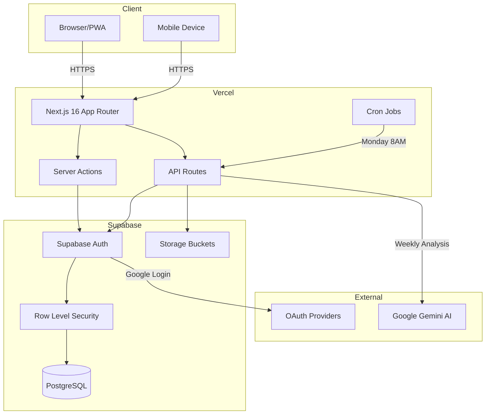
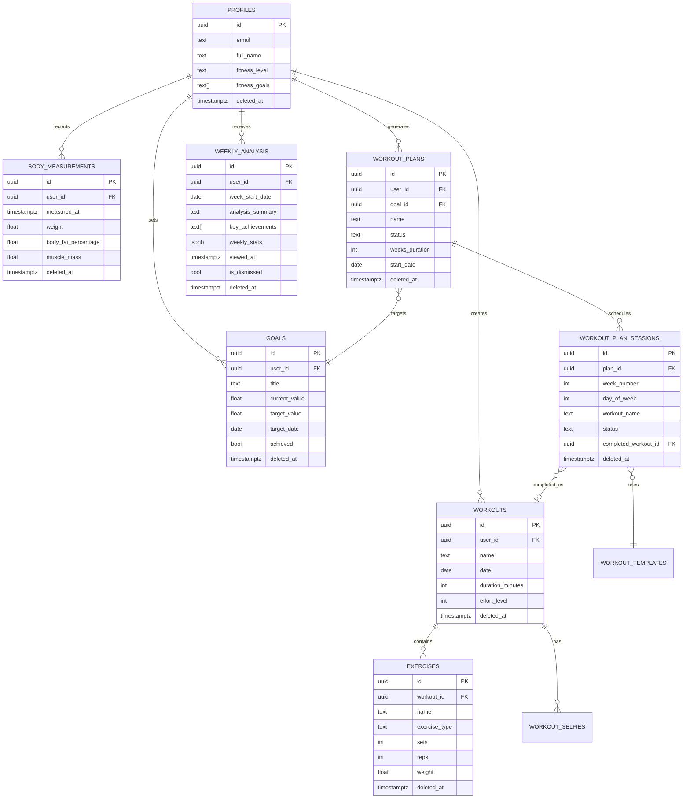

# Architecture Overview

## System Design

## Tech Stack

### Frontend
- **Framework:** Next.js 16 App Router
- **Language:** TypeScript 5
- **UI:** React 19 + Tailwind CSS 4 + shadcn/ui
- **State:** React hooks + Zustand (minimal)
- **Forms:** React Hook Form + Zod validation

### Backend
- **Database:** PostgreSQL via Supabase
- **Auth:** Supabase Auth (email/OAuth)
- **Storage:** Supabase Storage (workout selfies)
- **Security:** Row-Level Security (RLS) policies
- **API:** Next.js API routes + Server Actions

### AI Services
- **Provider:** Google Gemini 2.0 Flash
- **Use Case:** Weekly workout analysis
- **Cost:** ~$0.01 per analysis
- **Scheduling:** Vercel Cron (Monday 8AM)

## Key Architectural Decisions

See [ADRs](adr/) for detailed decision rationale:
- [001: Weekly Analysis with Gemini AI](adr/001-weekly-analysis-ai-gemini.md)

## Database Schema

### Design Patterns
- **Soft Delete:** All tables use `deleted_at` timestamp
- **RLS:** All queries filtered by `auth.uid()`
- **Denormalization:** Stats stored in JSONB for performance
- **Indexing:** Composite indexes on `(user_id, date, deleted_at)`

## Security Model

### Authentication
- Supabase Auth with JWT tokens
- Cookie-based sessions (httpOnly, secure)
- OAuth providers: Google

### Authorization
- Row-Level Security on all tables
- Policies enforce `user_id = auth.uid()`
- API routes verify auth before processing

### Data Protection
- No PII in logs
- Encrypted at rest (Supabase default)
- HTTPS only in production

## Deployment

### Production (Vercel)
- **Build:** `yarn build` (Next.js static + server)
- **Env Vars:** Supabase keys, Gemini API key, CRON_SECRET
- **Cron Jobs:** Configured in `vercel.json`
- **CDN:** Automatic via Vercel Edge Network

### Database (Supabase)
- **Migrations:** Applied via `npx supabase db push`
- **Backups:** Daily automatic backups
- **Monitoring:** Supabase Dashboard

## Performance Considerations

### Frontend
- Server-side rendering for SEO
- Client-side navigation (App Router)
- Optimistic updates on mutations
- Image optimization (next/image)

### Backend
- Database connection pooling
- Indexed queries only
- JSONB for flexible data
- Caching via React Server Components

### AI
- Async job processing
- Batched user analysis
- Error handling per-user (fail gracefully)

## Monitoring

- Build logs: Vercel Dashboard
- Cron execution: Vercel Functions logs
- Database: Supabase Logs
- Errors: Console logs (consider Sentry for production)
