# Architecture Overview

## System Design

### High-Level Architecture

The application follows a modern JAMstack architecture with Next.js 16 on Vercel, Supabase for backend services, and Google Gemini for AI capabilities.

```mermaid
graph TB
    subgraph Client["Client Layer"]
        Browser["🌐 Browser/PWA<br/>(Progressive Web App)"]
        Mobile["📱 Mobile Device<br/>(iOS/Android)"]
    end

    subgraph Vercel["Vercel Cloud Platform"]
        NextJS["⚛️ Next.js 16 App Router<br/>React 19 + TypeScript"]
        API["🔌 API Routes<br/>(21 REST endpoints)"]
        ServerActions["⚡ Server Actions<br/>(form submissions)"]
    end

    subgraph Supabase["Supabase Backend"]
        Auth["🔐 Supabase Auth<br/>(JWT + OAuth)"]
        DB[("📊 PostgreSQL<br/>(11 tables)<br/>RLS enabled")]
        Storage["📦 Storage Buckets<br/>(workout selfies)"]
        RLS["🛡️ Row Level Security<br/>(user_id policies)"]
    end

    subgraph External["External Services"]
        Gemini["🤖 Google Gemini 2.5 Pro<br/>(AI generation)"]
        OAuth["🔑 OAuth Providers<br/>(Google)"]
    end

    Browser -->|"HTTPS<br/>GET/POST"| NextJS
    Mobile -->|"HTTPS<br/>PWA install"| NextJS
    NextJS -->|"mutations"| ServerActions
    NextJS -->|"data fetch"| API
    ServerActions -->|"verify JWT"| Auth
    API -->|"verify JWT"| Auth
    Auth -.->|"enforce"| RLS
    RLS -->|"filter by user_id"| DB
    API -->|"upload/download<br/>5MB max"| Storage
    API -->|"AI plan generation<br/>temp: 0.7"| Gemini
    API -->|"weekly analysis<br/>~$0.01/analysis"| Gemini
    Auth -->|"OAuth2 flow"| OAuth

    style Browser fill:#e1f5ff
    style Mobile fill:#e1f5ff
    style NextJS fill:#fff3e0
    style API fill:#fff3e0
    style ServerActions fill:#fff3e0
    style DB fill:#f3e5f5
    style Auth fill:#f3e5f5
    style Storage fill:#f3e5f5
    style Gemini fill:#e8f5e9
    style OAuth fill:#e8f5e9
```



**Flow Explanation:**
1. **Client → Vercel**: Users access via browser or installed PWA over HTTPS
2. **Next.js → Supabase**: Server Actions and API routes authenticate with JWT tokens
3. **Auth → RLS**: Every database query is filtered by the authenticated user's ID
4. **API → Storage**: Workout selfies stored in private buckets (max 5MB per file)
5. **API → Gemini**: AI generates workout plans and weekly analysis on-demand
6. **Auth → OAuth**: Google OAuth for seamless authentication

## Tech Stack

### Frontend
- **Framework:** Next.js 16.0.3 (App Router with Turbopack)
- **Language:** TypeScript 5
- **UI:** React 19.2.0 + Tailwind CSS 4 + shadcn/ui (Radix UI)
- **State:** React hooks + Zustand 5.0.8 (minimal)
- **Forms:** React Hook Form 7.66.0 + Zod 4.1.12 validation
- **Charts:** Recharts 3.4.1
- **Icons:** Lucide React 0.554.0
- **Date Utils:** date-fns 4.1.0
- **PWA:** @ducanh2912/next-pwa 10.2.9

### Backend
- **Database:** PostgreSQL via Supabase
- **Auth:** Supabase Auth (@supabase/ssr 0.7.0, email/OAuth)
- **Storage:** Supabase Storage (workout selfies, max 5MB)
- **Security:** Row-Level Security (RLS) policies on all tables
- **API:** Next.js API routes (21 endpoints) + Server Actions

### AI Services
- **Provider:** Google Gemini 2.5 Pro (@google/generative-ai 0.24.1)
- **Use Cases:**
  - AI-generated workout plans
  - Weekly workout analysis
- **Cost:** ~$0.01 per analysis
- **Trigger:** Manual + Auto-generation on dashboard visit

## Key Architectural Decisions

See [ADRs](adr/) for detailed decision rationale:
- [001: Weekly Analysis with Gemini AI](adr/001-weekly-analysis-ai-gemini.md)

## Database Schema

### Entity Relationship Diagram

11 tables with full Row-Level Security (RLS) policies. All tables implement soft deletes via `deleted_at` timestamp.


### Design Patterns
- **Soft Delete:** All tables use `deleted_at` timestamp
- **RLS:** All queries filtered by `auth.uid()` with specific policies per table
- **Denormalization:** Stats stored in JSONB for performance (exercises in sessions, weekly_stats, goal_progress)
- **Indexing:** Composite indexes on `(user_id, date, deleted_at)` for optimal query performance
- **Unique Constraints:** `unique_user_week` on weekly_workout_analysis prevents duplicate analysis

### Table Highlights
- **workout_selfies**: Stores images in Supabase Storage bucket 'workout-selfies' (max 5MB per file)
- **workout_templates**: 10 public templates seeded (StrongLifts 5x5, PPL, HIIT, Core, etc.)
- **workout_plan_sessions**: Day-of-week based scheduling (0=Sunday, 6=Saturday) with actual_date
- **body_measurements**: 20+ metrics tracked (weight, body fat, muscle mass, circumferences, visceral fat, metabolic age)
- **user_workout_preferences**: Used by AI to personalize workout plan generation

### User Journey: Workout Plan Generation

This sequence diagram shows how AI-powered workout plans are generated:


### User Journey: Weekly Analysis

This sequence diagram shows the auto-generation of weekly analysis:


### Data Flow: Workout Logging

This diagram shows how workout data flows through the system:

```mermaid
flowchart TD
    Start([User opens<br/>New Workout form]) --> Form[Fill workout details:<br/>• Name, date, duration<br/>• Effort level 1-6]
    Form --> AddExercise{Add exercises?}

    AddExercise -->|Yes| ExerciseType{Exercise type?}
    ExerciseType -->|Strength| StrengthForm[Enter:<br/>• Sets, reps<br/>• Weight + unit]
    ExerciseType -->|Cardio| CardioForm[Enter:<br/>• Duration, distance<br/>• Speed, calories]
    ExerciseType -->|Functional| FunctionalForm[Enter:<br/>• Description<br/>• Duration]

    StrengthForm --> MoreExercises{More exercises?}
    CardioForm --> MoreExercises
    FunctionalForm --> MoreExercises
    MoreExercises -->|Yes| AddExercise
    MoreExercises -->|No| Selfie{Upload selfie?}

    AddExercise -->|No| Selfie
    Selfie -->|Yes| UploadSelfie[Select photo<br/>Max 5MB<br/>Optional caption]
    Selfie -->|No| Submit
    UploadSelfie --> Submit[Submit workout]

    Submit --> API[POST /api/workouts]
    API --> ValidateAuth{JWT valid?}
    ValidateAuth -->|No| Error401[401 Unauthorized]
    ValidateAuth -->|Yes| ValidateData{Data valid?}
    ValidateData -->|No| Error400[400 Bad Request]
    ValidateData -->|Yes| CreateWorkout[Insert workout row]

    CreateWorkout --> CreateExercises[Insert exercise rows<br/>Link to workout_id]
    CreateExercises --> HasSelfie{Has selfie?}
    HasSelfie -->|Yes| UploadStorage[Upload to Supabase Storage<br/>workout-selfies bucket]
    UploadStorage --> CreateSelfieRecord[Insert workout_selfie row<br/>Store file_path]
    HasSelfie -->|No| CheckPlan
    CreateSelfieRecord --> CheckPlan{Part of plan?}

    CheckPlan -->|Yes| UpdateSession[Update session:<br/>completed_workout_id<br/>status = completed]
    CheckPlan -->|No| UpdateGoal{Related to goal?}
    UpdateSession --> UpdateGoal

    UpdateGoal -->|Yes| SyncGoal[Update goal.current_value<br/>Check if achieved]
    UpdateGoal -->|No| Success
    SyncGoal --> Success[200 OK<br/>Return workout data]

    Success --> Redirect[Redirect to /workouts]
    Error401 --> ShowError[Show error message]
    Error400 --> ShowError
    Redirect --> End([User sees workout list])
    ShowError --> End

    style Start fill:#e8f5e9
    style End fill:#e8f5e9
    style Error401 fill:#ffebee
    style Error400 fill:#ffebee
    style Success fill:#e1f5ff
    style API fill:#fff3e0
    style UploadStorage fill:#f3e5f5
```



## Security Model

### Authentication
- Supabase Auth with JWT tokens
- Cookie-based sessions (httpOnly, secure)
- OAuth providers: Google

### Authorization
- Row-Level Security on all tables
- Policies enforce `user_id = auth.uid()`
- API routes verify auth before processing

### Data Protection
- No PII in logs
- Encrypted at rest (Supabase default)
- HTTPS only in production

## Application Features

### Core Features
1. **Dashboard** (`/dashboard`)
   - Weekly analysis display with AI insights
   - Workout statistics and streak tracking
   - Active workout plan overview
   - Recent workouts list

2. **Workout Tracking** (`/workouts`)
   - Log workouts with exercises (strength/cardio/functional)
   - Upload progress selfies (max 5MB per image)
   - Track effort level (1-6 scale)
   - View workout history

3. **Goals Management** (`/goals`)
   - Create goals with initial, current, target values
   - Track progress with visual indicators
   - Sync with workout plans

4. **Body Measurements** (`/measurements`)
   - Track 20+ body metrics
   - Time-series charts
   - Compare measurements over time

5. **AI Workout Plans** (`/workout-plans`)
   - Generate personalized plans (1-12 weeks, 1-7 workouts/week)
   - Based on goals, profile, workout history, preferences
   - Progressive overload built-in
   - Weekly schedule with day-specific sessions
   - Track completion status

6. **Workout Templates** (`/workout-plans/templates`)
   - 10 public templates (StrongLifts, PPL, HIIT, etc.)
   - Create custom templates
   - Reusable across plans

7. **Profile & Preferences** (`/profile`, `/workout-plans/preferences`)
   - Set fitness level, medical conditions, injuries
   - Configure workout preferences (equipment, duration, focus areas)
   - Customize days and intensity

8. **Weekly Analysis** (Auto-generated)
   - AI analyzes previous week's performance
   - Key achievements, areas for improvement, recommendations
   - Motivational quote
   - View/dismiss functionality

### API Endpoints (21 routes)
- **Auth:** `/api/auth/callback`
- **Workouts:** `/api/workouts` (GET, POST)
- **Goals:** `/api/goals` (GET, POST)
- **Workout Plans:** `/api/workout-plans`, `/api/workout-plans/[id]`, `/api/workout-plans/generate`, `/api/workout-plans/[id]/activate`, `/api/workout-plans/[id]/deactivate`
- **Sessions:** `/api/workout-plans/sessions/[id]`, `/api/workout-plans/sessions/[id]/details`, `/api/workout-plans/sessions/[id]/complete`, `/api/workout-plans/sessions/current-week`, `/api/workout-plans/[id]/week/[weekNumber]`
- **Templates:** `/api/workout-templates`
- **Weekly Analysis:** `/api/weekly-analysis/generate`, `/api/weekly-analysis/latest`, `/api/weekly-analysis/[id]/view`, `/api/weekly-analysis/[id]/dismiss`
- **Images:** `/api/images/[...path]` (Optimized image serving)
- **Jobs:** `/api/workout-plans/jobs/[id]`

## AI Integration Details

### Workout Plan Generation (`lib/workout-plans/ai-generator.ts`)
**Model:** Google Gemini 2.5 Pro
**Temperature:** 0.7 (balanced creativity)
**Max Tokens:** 16,000

**Inputs:**
- User profile (age, gender, height, fitness level, medical conditions, injuries)
- Latest body measurements (weight, body fat, muscle mass, BMI)
- Workout history with exercise-specific performance data
- User preferences (equipment, gym access, duration, focus areas, preferred days)
- Goal details (weight loss, muscle building, endurance, general fitness)
- Available workout templates

**Process:**
1. Analyze exercise history to recommend appropriate weights (baseline + 5-10% progressive overload)
2. Generate 1-12 week plans with 1-7 workouts per week
3. Smart scheduling: ensures rest days between intense sessions
4. Day-of-week based scheduling (0=Sunday through 6=Saturday)
5. 4-6 exercises per workout (quality over quantity)

**Output:** Structured JSON with weekly schedule, exercises (sets/reps/weights), intensity levels, rationale, progression strategy

### Weekly Analysis (`lib/weekly-analysis/ai-analyzer.ts`)
**Model:** Google Gemini 2.5 Pro
**Schedule:** Auto-trigger on dashboard visit if no analysis exists for current week

**Data Analyzed:**
- Weekly stats (workouts completed, duration, effort level, exercise types)
- Goal progress with percentage complete
- Body measurement changes (weight, body fat, muscle mass)
- Active workout plan status
- Recent workout details

**Output:**
- 2-3 paragraph comprehensive analysis summary
- Key achievements (3 items)
- Areas for improvement (2 items)
- Actionable recommendations (3 items)
- Personalized motivational quote (not generic)

**Week Detection:** Monday-Sunday weeks, analysis for current week only

## Deployment

### Production (Vercel)
- **Build:** `yarn build` (linting + Next.js build with Turbopack)
- **Build Skip Lint:** `yarn build:skip-lint` (faster builds)
- **Env Vars:**
  - `NEXT_PUBLIC_SUPABASE_URL`
  - `NEXT_PUBLIC_SUPABASE_ANON_KEY`
  - `NEXT_PUBLIC_APP_URL`
  - `GEMINI_API_KEY` (optional, for AI features)
- **CDN:** Automatic via Vercel Edge Network
- **PWA:** Disabled in development, enabled in production

### Database (Supabase)
- **Migrations:** Applied via `npx supabase db push`
- **Current Migrations:**
  - `000_consolidated_schema.sql` - Base schema
  - `001_add_plan_start_dates.sql` - Added start_date fields
  - `002_add_weekly_workout_analysis.sql` - Weekly analysis table
- **Backups:** Daily automatic backups
- **Monitoring:** Supabase Dashboard

## Performance Considerations

### Frontend
- **Server-side rendering** for SEO and initial page load
- **Client-side navigation** (Next.js App Router with prefetching)
- **Turbopack** for faster development builds
- **Image optimization** (next/image with WebP/AVIF, responsive sizes)
- **PWA caching** with aggressive front-end nav caching
- **React 19** with improved concurrency features

### Backend
- **Database connection pooling** via Supabase
- **Indexed queries** with composite indexes on (user_id, date, deleted_at)
- **JSONB for flexible data** (exercises, stats, preferences)
- **Caching** via React Server Components
- **10MB body size limit** for file uploads

### AI
- **Async job processing** via workout_plan_generation_jobs table
- **Auto-trigger** weekly analysis on dashboard visit (not scheduled cron)
- **Error handling** per-user (fail gracefully with error messages)
- **Cost optimization** (~$0.01 per analysis with Gemini 2.5 Pro)

### Storage
- **Supabase Storage** for workout selfies
- **5MB max file size** per image
- **Private bucket** with RLS policies
- **Signed URLs** for secure access

## Configuration Files

### `next.config.ts`
- Turbopack enabled
- React Strict Mode
- Server Actions body size limit: 10MB
- Image optimization: WebP/AVIF formats
- PWA configuration via @ducanh2912/next-pwa

### `package.json`
- Node.js >= 22.0.0 required
- Yarn >= 1.22.0
- Scripts: `dev`, `build`, `build:skip-lint`, `test`, `lint`, `api:docs`, `api:validate`

### `public/manifest.json`
- App name: "GoodHealth - Gym Tracker"
- Display: standalone (full-screen PWA)
- Orientation: portrait-primary
- Theme color: #000000

## Testing & CI/CD

### Testing
- **Framework:** Jest 30.2.0 with jsdom environment
- **Library:** Testing Library (React, DOM, User Events)
- **Coverage:** Tracked with Codecov
- **Commands:**
  - `yarn test` - Run tests
  - `yarn test:watch` - Watch mode
  - `yarn test:coverage` - Generate coverage report

### CI/CD Pipeline (`.github/workflows/ci.yml`)
- **Triggers:** Push/PR to main or develop branches
- **Jobs:**
  1. **Test:** Lint + Jest with coverage → Codecov upload
  2. **Build:** Next.js build with Supabase env vars
- **Node Version:** 24 (should align with package.json requirement >=22)
- **Badges:** CI status, Codecov, MIT License

## Monitoring & Logging

- **Build Logs:** Vercel Dashboard
- **Function Logs:** Vercel Functions logs
- **Database:** Supabase Logs and Dashboard
- **Errors:** Console logs (consider Sentry for production)
- **AI Responses:** Logged in workout_plan_generation_jobs (request_data, ai_response_data)

## Code Organization

### Application Layer Architecture

The codebase follows a clear separation of concerns with Next.js App Router conventions:


### Directory Structure

```
goodhealth/
├── app/                           # Next.js App Router (26+ routes)
│   ├── api/                       # API Routes (21 endpoints)
│   │   ├── auth/callback/         # OAuth callback
│   │   ├── goals/                 # Goals CRUD
│   │   ├── workouts/              # Workout CRUD
│   │   ├── workout-plans/         # Plans & sessions
│   │   ├── workout-templates/     # Template library
│   │   ├── weekly-analysis/       # AI analysis
│   │   └── images/[...path]/      # Image optimization
│   ├── dashboard/                 # Main dashboard
│   ├── workouts/                  # Workout tracking
│   │   ├── new/                   # Log workout
│   │   └── [id]/                  # View/edit workout
│   ├── goals/                     # Goal management
│   ├── measurements/              # Body measurements
│   ├── workout-plans/             # Workout plans
│   │   ├── new/                   # Generate plan
│   │   ├── preferences/           # Set preferences
│   │   ├── templates/             # Template library
│   │   └── [id]/                  # Plan details & progress
│   ├── profile/                   # User profile
│   ├── settings/                  # App settings
│   ├── login/                     # Login page
│   ├── signup/                    # Registration
│   ├── forgot-password/           # Password reset
│   ├── layout.tsx                 # Root layout (auth wrapper)
│   └── page.tsx                   # Landing page
│
├── lib/                           # Business Logic (73+ functions)
│   ├── auth/                      # Authentication
│   │   ├── actions.ts             # Sign in/out, password reset
│   │   └── hooks.ts               # useUser, useAuth
│   ├── workout-plans/             # Workout Plans
│   │   ├── ai-generator.ts        # Gemini plan generation ⭐
│   │   ├── generator.ts           # Plan creation logic
│   │   ├── actions.ts             # CRUD operations
│   │   ├── session-actions.ts     # Session management
│   │   ├── job-processor.ts       # Job tracking
│   │   ├── preferences-actions.ts # User preferences
│   │   └── planning/              # Planning algorithms
│   │       ├── goal-analyzer.ts   # Goal analysis
│   │       ├── template-selector.ts # Template matching
│   │       ├── schedule-generator.ts # Weekly schedule
│   │       └── progressive-overload.ts # Weight progression
│   ├── weekly-analysis/           # Weekly Analysis
│   │   └── ai-analyzer.ts         # Gemini analysis ⭐
│   ├── workouts/                  # Workouts
│   │   └── actions.ts             # CRUD operations
│   ├── goals/                     # Goals
│   │   ├── actions.ts             # CRUD operations
│   │   ├── sync.ts                # Goal-plan sync
│   │   ├── progress.ts            # Progress calculations
│   │   └── calculate-initial-value.ts # Initial value logic
│   ├── measurements/              # Body Measurements
│   │   └── actions.ts             # CRUD operations
│   ├── profile/                   # Profile
│   │   └── actions.ts             # Profile updates
│   ├── selfies/                   # Selfie Uploads
│   │   └── actions.ts             # Upload to Storage
│   ├── supabase/                  # Supabase Clients
│   │   ├── client.ts              # Browser client
│   │   └── server.ts              # Server client (SSR)
│   ├── data/                      # Static Data
│   │   └── gym-equipment.ts       # Equipment list
│   └── utils.ts                   # Utility functions
│
├── components/                    # React Components (24+)
│   ├── ui/                        # shadcn/ui components
│   │   ├── button.tsx             # Button
│   │   ├── card.tsx               # Card
│   │   ├── dialog.tsx             # Modal dialog
│   │   ├── form.tsx               # Form components
│   │   ├── select.tsx             # Select dropdown
│   │   ├── tabs.tsx               # Tabs
│   │   └── ...                    # 15+ more
│   ├── workout-form.tsx           # Workout logging form
│   ├── exercise-form.tsx          # Exercise input
│   ├── goal-progress.tsx          # Goal progress chart
│   ├── weekly-analysis-card.tsx   # AI insights display
│   └── ...                        # Custom components
│
├── migrations/                    # Database Migrations
│   ├── 000_consolidated_schema.sql       # Base schema (11 tables)
│   ├── 001_add_plan_start_dates.sql      # Start date fields
│   └── 002_add_weekly_workout_analysis.sql # Weekly analysis
│
├── docs/                          # Documentation
│   ├── ARCHITECTURE.md            # This file
│   ├── SETUP.md                   # Installation guide
│   ├── TESTING.md                 # Testing guide
│   ├── DEPLOYMENT.md              # Deployment guide
│   ├── api/                       # API Documentation
│   │   └── openapi.yaml           # OpenAPI 3.1.0 spec
│   └── adr/                       # Architecture Decisions
│       └── 001-weekly-analysis-ai-gemini.md
│
├── public/                        # Static Assets
│   ├── manifest.json              # PWA manifest
│   ├── favicon.ico                # Favicon
│   └── icons/                     # App icons (TODO)
│
├── next.config.ts                 # Next.js config (Turbopack, PWA)
├── tailwind.config.ts             # Tailwind CSS config
├── tsconfig.json                  # TypeScript config
├── jest.config.js                 # Jest testing config
├── package.json                   # Dependencies & scripts
└── README.md                      # Project overview

⭐ = AI-powered with Google Gemini 2.5 Pro
```

### Key Files

**AI & Core Logic:**
- `lib/workout-plans/ai-generator.ts` - Gemini workout plan generation (16K tokens, temp 0.7)
- `lib/weekly-analysis/ai-analyzer.ts` - Gemini weekly analysis (~$0.01/analysis)
- `lib/workout-plans/planning/progressive-overload.ts` - Weight progression algorithm
- `lib/goals/sync.ts` - Goal-plan synchronization

**Database Clients:**
- `lib/supabase/client.ts` - Browser-side Supabase client
- `lib/supabase/server.ts` - Server-side Supabase client (SSR, cookies)

**Entry Points:**
- `app/layout.tsx` - Root layout with authentication wrapper
- `app/page.tsx` - Landing page
- `app/dashboard/page.tsx` - Main dashboard (triggers weekly analysis)

**API Documentation:**
- `docs/api/openapi.yaml` - OpenAPI 3.1.0 specification (22 operationIds)

**Configuration:**
- `next.config.ts` - Turbopack, PWA, image optimization, 10MB body limit
- `migrations/` - Database schema evolution (3 migrations)
