# Architecture Overview

## System Design

### High-Level Architecture

GoodHealth is a **monorepo** with a clear separation between frontend and backend:

- **Frontend**: Next.js React application deployed on **Vercel**
- **Backend**: Python FastAPI application deployed on **Railway**
- **Database**: PostgreSQL managed by **Supabase**
- **AI**: Google Gemini for workout planning and weekly analysis

```mermaid
graph TB
    subgraph Client["Client Layer"]
        Browser["🌐 Browser/PWA"]
        Mobile["📱 Mobile Device"]
    end

    subgraph Vercel["Vercel (Frontend)"]
        NextJS["⚛️ Next.js 16<br/>React + TypeScript"]
        ServerActions["⚡ Server Actions<br/>(thin proxies)"]
    end

    subgraph Railway["Railway (Backend)"]
        FastAPI["🐍 FastAPI<br/>Python 3.13"]
        AIServices["🤖 AI Services<br/>(Gemini integration)"]
        CRUD["📊 CRUD Services<br/>(business logic)"]
    end

    subgraph Supabase["Supabase"]
        Auth["🔐 Supabase Auth<br/>(JWT + OAuth)"]
        DB[("📊 PostgreSQL<br/>(12 tables)")]
        Storage["📦 Storage<br/>(workout selfies)"]
        RLS["🛡️ Row Level Security"]
    end

    subgraph External["External Services"]
        Gemini["🤖 Google Gemini Pro"]
        OAuth["🔑 Google OAuth"]
    end

    Browser -->|HTTPS| NextJS
    Mobile -->|PWA| NextJS
    NextJS --> ServerActions
    ServerActions -->|"JWT Bearer"| FastAPI
    FastAPI --> AIServices
    FastAPI --> CRUD
    AIServices --> Gemini
    CRUD --> Auth
    Auth -.-> RLS
    RLS --> DB
    CRUD --> Storage
    Auth --> OAuth

    style Browser fill:#e1f5ff
    style Mobile fill:#e1f5ff
    style NextJS fill:#fff3e0
    style ServerActions fill:#fff3e0
    style FastAPI fill:#c8e6c9
    style AIServices fill:#c8e6c9
    style CRUD fill:#c8e6c9
    style DB fill:#f3e5f5
    style Auth fill:#f3e5f5
    style Gemini fill:#e8f5e9
```



### Request Flow

1. **User** interacts with the Next.js frontend on Vercel
2. **Server Actions** act as thin proxies, forwarding requests to the Python backend
3. **FastAPI** validates the JWT token (from Supabase Auth) via middleware
4. **Services** handle business logic, AI generation, and database operations
5. **Supabase** provides PostgreSQL with Row-Level Security for data isolation

## Project Structure

```
goodhealth/
├── frontend/                    # Next.js application (Vercel)
│   ├── app/                     # App Router pages (26+ routes)
│   ├── components/              # React components (24+)
│   ├── lib/                     # Business logic & API client
│   │   ├── api/client.ts        # Python API client
│   │   ├── auth/                # Auth actions & hooks
│   │   ├── goals/               # Goal actions
│   │   ├── measurements/        # Measurement actions
│   │   ├── profile/             # Profile actions
│   │   ├── selfies/             # Selfie actions
│   │   ├── workout-plans/       # Plan actions
│   │   └── workouts/            # Workout actions
│   ├── types/                   # TypeScript types
│   ├── __tests__/               # Jest tests
│   ├── package.json
│   └── next.config.ts
│
├── backend/                     # Python FastAPI (Railway)
│   ├── app/
│   │   ├── main.py              # FastAPI app entry
│   │   ├── config.py            # Settings (Pydantic)
│   │   ├── dependencies.py      # FastAPI dependencies
│   │   ├── middleware/
│   │   │   └── auth.py          # JWT authentication
│   │   ├── models/              # Pydantic models
│   │   │   ├── goal.py
│   │   │   ├── measurement.py
│   │   │   ├── profile.py
│   │   │   ├── selfie.py
│   │   │   ├── workout.py
│   │   │   ├── workout_plan.py
│   │   │   └── weekly_analysis.py
│   │   ├── routers/             # API endpoints
│   │   │   ├── goals.py
│   │   │   ├── measurements.py
│   │   │   ├── profiles.py
│   │   │   ├── selfies.py
│   │   │   ├── workouts.py
│   │   │   ├── workout_plans.py
│   │   │   └── weekly_analysis.py
│   │   ├── services/            # Business logic
│   │   │   ├── ai_plan_generator.py
│   │   │   ├── gemini_client.py
│   │   │   ├── goal_sync.py
│   │   │   ├── goals_crud.py
│   │   │   ├── measurements.py
│   │   │   ├── profiles.py
│   │   │   ├── selfies.py
│   │   │   ├── weekly_analyzer.py
│   │   │   ├── workout_plans_crud.py
│   │   │   └── workouts.py
│   │   └── utils/
│   │       ├── supabase_client.py
│   │       └── unit_converter.py
│   ├── migrations/              # SQL migrations
│   ├── scripts/                 # Utility scripts
│   ├── tests/                   # Pytest tests
│   ├── Dockerfile
│   ├── requirements.txt
│   └── .python-version          # Python 3.13
│
├── docs/                        # Documentation
│   ├── ARCHITECTURE.md          # This file
│   ├── DEPLOYMENT.md            # Deployment guide
│   ├── SETUP.md                 # Setup guide
│   └── api/openapi.yaml         # API spec
│
├── .github/workflows/           # CI/CD
│   └── ci.yml                   # Test & build
├── package.json                 # Monorepo scripts
├── vercel.json                  # Vercel config
└── sonar-project.properties     # SonarCloud config
```

## Tech Stack

### Frontend (Next.js on Vercel)

| Category | Technology | Purpose |
|----------|------------|---------|
| Framework | Next.js 16 (App Router) | SSR, routing, Server Actions |
| Language | TypeScript | Type safety |
| UI | React + Tailwind CSS + shadcn/ui | Components & styling |
| Forms | React Hook Form + Zod | Form handling & validation |
| Charts | Recharts | Data visualization |
| PWA | @ducanh2912/next-pwa | Offline support |
| Testing | Jest + Testing Library | Unit & integration tests |

### Backend (FastAPI on Railway)

| Category | Technology | Purpose |
|----------|------------|---------|
| Framework | FastAPI | High-performance async API |
| Language | Python 3.13 | Latest stable Python |
| Validation | Pydantic v2 | Data models & validation |
| Database | Supabase Python | PostgreSQL client |
| AI | google-generativeai | Gemini integration |
| Auth | PyJWT | JWT verification |
| Testing | pytest + pytest-asyncio | Async tests |
| Linting | ruff + black + mypy | Code quality |

### Infrastructure

| Service | Provider | Purpose |
|---------|----------|---------|
| Frontend Hosting | Vercel | CDN, serverless functions |
| Backend Hosting | Railway | Container deployment |
| Database | Supabase | Managed PostgreSQL |
| File Storage | Supabase Storage | Workout selfies |
| AI | Google Gemini Pro | Plan generation, analysis |
| CI/CD | GitHub Actions | Tests, builds, deploys |
| Code Quality | SonarCloud | Static analysis |

## API Architecture

### Backend API Endpoints

```
/api/health                      GET     Health check
/api/profile                     GET     Get user profile
/api/profile                     PUT     Update profile

/api/workouts                    GET     List workouts
/api/workouts                    POST    Create workout
/api/workouts/{id}               GET     Get workout
/api/workouts/{id}               PUT     Update workout
/api/workouts/{id}               DELETE  Delete workout
/api/workouts/{id}/exercises/{e} DELETE  Delete exercise

/api/goals                       GET     List goals
/api/goals                       POST    Create goal
/api/goals/{id}                  GET     Get goal
/api/goals/{id}                  PUT     Update goal
/api/goals/{id}                  DELETE  Delete goal
/api/goals/{id}/progress         PUT     Update progress

/api/measurements                GET     List measurements
/api/measurements                POST    Create measurement
/api/measurements/latest         GET     Get latest
/api/measurements/{id}           PUT     Update measurement
/api/measurements/{id}           DELETE  Delete measurement

/api/selfies/{id}                DELETE  Delete selfie
/api/selfies/{id}/caption        PUT     Update caption
/api/selfies/url                 GET     Get signed URL
/api/selfies/recent              GET     Recent selfies
/api/workouts/{id}/selfie        GET     Get workout selfies
/api/workouts/{id}/selfie        POST    Upload selfie

/api/workout-plans               GET     List plans
/api/workout-plans               POST    Create plan
/api/workout-plans/{id}          GET     Get plan
/api/workout-plans/{id}          PUT     Update plan
/api/workout-plans/{id}          DELETE  Delete plan
/api/workout-plans/{id}/activate POST    Activate plan
/api/workout-plans/{id}/complete POST    Complete plan
/api/workout-plans/{id}/deactivate POST  Deactivate plan
/api/workout-plans/current-week  GET     Current week sessions
/api/workout-plans/preferences   GET     Get preferences
/api/workout-plans/preferences   PUT     Update preferences
/api/workout-plans/templates     GET     List templates
/api/workout-plans/templates     POST    Create template
/api/workout-plans/templates/{id} DELETE Delete template

/api/weekly-analysis             POST    Generate analysis
/api/weekly-analysis/latest      GET     Get latest analysis
```

### Authentication Flow


## Database Schema

### Entity Relationship Diagram


### Key Design Patterns

- **Soft Delete**: All tables use `deleted_at` timestamp
- **Row-Level Security**: All queries filtered by `auth.uid()`
- **JSONB**: Flexible data for exercises, stats, preferences
- **Composite Indexes**: `(user_id, date, deleted_at)` for queries

## AI Integration

### Workout Plan Generation

**Service:** `backend/app/services/ai_plan_generator.py`
**Model:** Google Gemini Pro (gemini-3.0-flash)

**Inputs:**
- User profile (age, gender, fitness level, medical conditions)
- Body measurements (weight, body fat, muscle mass)
- Workout history with performance data
- User preferences (equipment, duration, focus areas)
- Goal details (type, target values)

**Output:** Structured JSON with:
- Weekly schedule (1-12 weeks, 1-7 workouts/week)
- Exercises per session (4-6 exercises)
- Progressive overload (5-10% weight increases)
- Rest day scheduling

### Weekly Analysis

**Service:** `backend/app/services/weekly_analyzer.py`
**Trigger:** Auto-generated on dashboard visit

**Analyzed Data:**
- Weekly workout stats
- Goal progress
- Body measurement changes
- Active plan status

**Output:**
- 2-3 paragraph summary
- Key achievements (3 items)
- Areas for improvement (2 items)
- Recommendations (3 items)
- Motivational quote

## Security Model

### Authentication

- **Supabase Auth** handles user registration and login
- **JWT tokens** stored in HTTP-only cookies
- **OAuth providers**: Google
- **Backend verification**: PyJWT validates tokens in middleware

### Authorization

- **Row-Level Security** on all Supabase tables
- **JWT middleware** extracts `user_id` on every request
- **Service layer** uses `user_id` for all queries

### Data Protection

- HTTPS only in production
- No PII in application logs
- Encrypted at rest (Supabase default)
- Signed URLs for storage access

## Development Workflow

### Running Locally

```bash
# Terminal 1: Frontend
cd frontend && yarn dev

# Terminal 2: Backend
cd backend && source venv/bin/activate && uvicorn app.main:app --reload

# Or use monorepo script
npm run dev  # Runs both with concurrently
```

### Testing

```bash
# Frontend tests
cd frontend && yarn test

# Backend tests
cd backend && pytest

# Both
npm test
```

### Environment Variables

**Frontend (`.env.local`):**
```env
NEXT_PUBLIC_SUPABASE_URL=
NEXT_PUBLIC_SUPABASE_ANON_KEY=
NEXT_PUBLIC_APP_URL=
PYTHON_API_URL=http://localhost:8000
```

**Backend (`.env`):**
```env
SUPABASE_URL=
SUPABASE_SERVICE_KEY=
SUPABASE_JWT_SECRET=
GEMINI_API_KEY=
GEMINI_MODEL=gemini-3.0-flash
```

## CI/CD Pipeline


### Pipeline Jobs

1. **test-frontend**: Lint + Jest tests with coverage
2. **test-backend**: Ruff lint + pytest with coverage
3. **build**: Next.js production build
4. **sonarcloud**: Code quality analysis

## Monitoring & Observability

| Aspect | Tool | Location |
|--------|------|----------|
| Frontend Logs | Vercel | Vercel Dashboard |
| Backend Logs | Railway | Railway Dashboard |
| Database | Supabase | Supabase Dashboard |
| Code Quality | SonarCloud | sonarcloud.io |
| Test Coverage | Codecov | codecov.io |

## Performance Considerations

### Frontend
- Server Components for initial data
- Client Components for interactivity
- Image optimization (WebP/AVIF)
- PWA caching

### Backend
- Async FastAPI handlers
- Connection pooling via Supabase
- Indexed database queries
- Response caching headers

### Database
- Composite indexes on common queries
- JSONB for flexible schemas
- RLS for automatic filtering

## Key Architectural Decisions

| Decision | Choice | Rationale |
|----------|--------|-----------|
| Backend Language | Python | AI library ecosystem, team expertise |
| Backend Framework | FastAPI | Async, auto-docs, Pydantic |
| Frontend Proxy | Server Actions | Maintains cookies, revalidation |
| Deployment Split | Vercel + Railway | Best-of-breed for each |
| Database | Supabase | RLS, Auth, Storage integrated |

See [ADRs](adr/) for detailed decision rationale.
